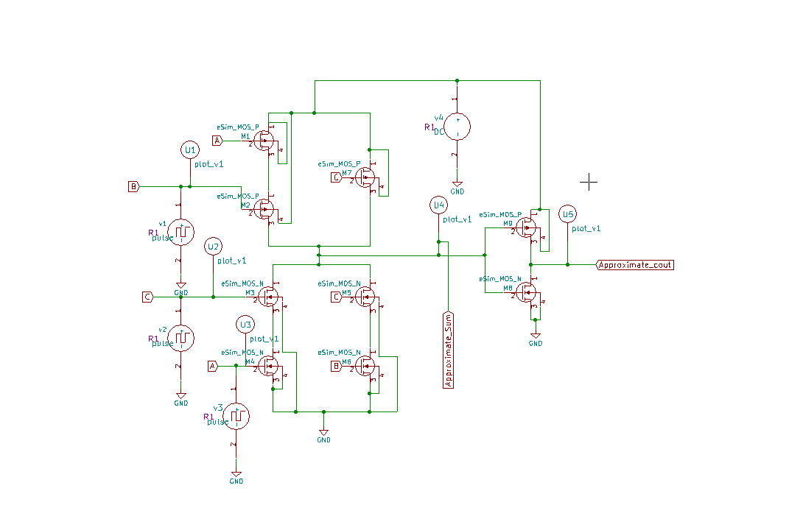
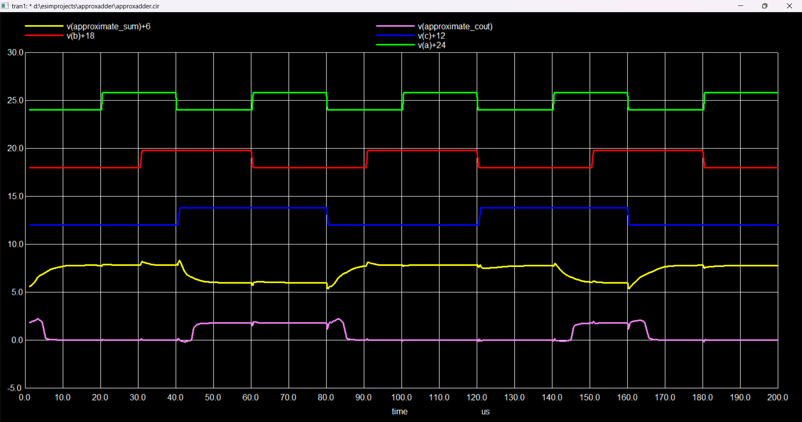
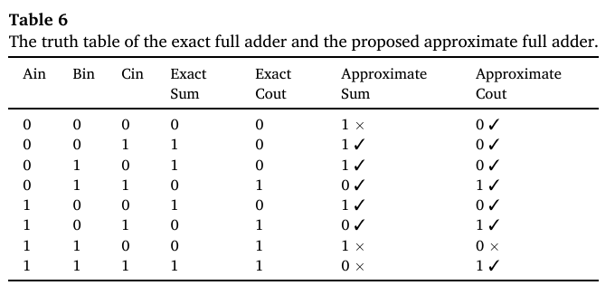

# lahaf-approximate-adder-esim

**Implementation of the LAHAF approximate full adder using static CMOS logic in eSim as part of FOSSEE Research Migration Project.**

---

### 🔬 **eSim Research Migration Project – FOSSEE, IIT Bombay**

### 💡 **Project Title: LAHAF – Low-Power, Area-Efficient, and High-Performance Approximate Full Adder using Static CMOS**

---

### 📘 **Description**

This project is part of the **eSim Research Migration Program** under **FOSSEE, IIT Bombay**, aimed at enhancing the open-source **eSim** circuit simulation tool.

The focus is on implementing an **approximate full adder (LAHAF)** using **Static CMOS logic**, chosen for its low-power and area-efficient characteristics. Approximate computing techniques are useful in domains such as:

- **Image Processing**
- **Machine Learning**
- **Data Mining**
- **DSP Processors**
- **Embedded Systems**

These applications tolerate small inaccuracies, enabling significant power and area savings.

---

### ⚙️ **Key Features**

- Designed using **Static CMOS Logic**
- Inverted **Sum** used to derive **Carry**
- Simulated using **eSim** (Ngspice backend)
- Evaluated for:
  - **Average Power Consumption**
  - **Propagation Delay**
  - **Output Waveforms**

---

### 📊 **Simulation Results**
### 🖼️ Schematic Diagram

### 📈 Output Waveform
#### ✔️ **Inputs and Outputs**
- **Inputs**: A, B, Cin  
- **Outputs**: Approximate Sum, Approximate Carry  

### 📋 Truth Table

---

### ⏱️ Propagation Delay in NGSPICE

The propagation delays for each input transition (**A**, **B**, **Cin**) affecting the **Sum** and **Carry** outputs were analyzed using **Ngspice** waveform results. Individual delays were measured from the input transition to the output response.

#### 🔍 Maximum Propagation Delays (from waveform):

- **Sum Output Delays (tp_Sum):**
  - A ➝ Sum: `4.393737e-05 s`  
  - B ➝ Sum: `8.687370e-06 s`  
  - Cin ➝ Sum: `-2.63126e-05 s`  
  ➤ **tp_Sum_max = 4.393737e-05 s**

- **Carry Output Delays (tp_Cout):**
  - A ➝ Carry: `4.488767e-05 s`  
  - B ➝ Carry: `9.637664e-06 s`  
  - Cin ➝ Carry: `-2.53623e-05 s`  
  ➤ **tp_Cout_max = 4.488767e-05 s**

#### 🧮 Overall Propagation Delay

- `tp_overall = max(tp_Sum_max, tp_Cout_max)`  
  ➤ **Overall Propagation Delay = 4.488767e-05 seconds**

#### 📉 Waveform showing Propagation Delay

  
*Figure: Input transitions (A, B, Cin) and corresponding delayed outputs (Sum, Carry)*

