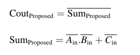
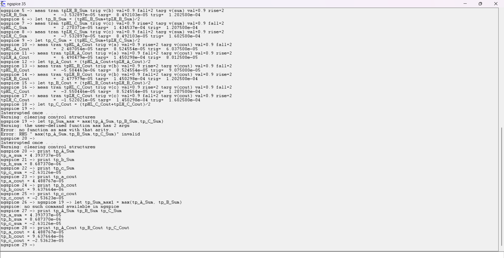

### 🔬 **eSim Research Migration Project – FOSSEE, IIT Bombay**

**Implementation of the LAHAF approximate full adder using static CMOS logic in eSim as part of FOSSEE Research Migration Project.**

---


### 💡 **Project Title: LAHAF – Low-Power, Area-Efficient, and High-Performance Approximate Full Adder using Static CMOS**

---

### 📘 **Description**

This project is part of the **eSim Research Migration Program** under **FOSSEE, IIT Bombay**, aimed at enhancing the open-source **eSim** circuit simulation tool.

The focus is on implementing an **approximate full adder (LAHAF)** using **Static CMOS logic**, chosen for its low-power and area-efficient characteristics. Approximate computing techniques are useful in domains such as:

- **Image Processing**
- **Machine Learning**
- **Data Mining**
- **DSP Processors**
- **Embedded Systems**


These applications tolerate small inaccuracies, enabling significant power and area savings.

---

### ⚙️ **Key Features**

- Designed using **Static CMOS Logic**  
- **Carry** is derived as the **logical complement** of the **Sum**  
- Simulated using **eSim** with **Ngspice**  
- Evaluated for:  
  - **Average Power Consumption**  
  - **Propagation Delay**  
  - **Output Waveforms**

---
### 📊 Simulation Results
### 🖼️ Schematic Diagram

### ⛳ Proposed Logic

The proposed approximate full adder is based on simplified logic where the **Carry** is derived from the **inverted Sum**.
**Logic Equations:**

The logic for the proposed adder is illustrated below:




### 📋 Truth Table


### 📈 Output Waveform
#### ✔️ **Inputs and Outputs**
- **Inputs**: A, B, Cin  
- **Outputs**: Approximate Sum, Approximate Carry  


---

### ⏱️ Propagation Delay in NGSPICE

The propagation delays for each input transition (**A**, **B**, **Cin**) affecting the **Sum** and **Carry** outputs were analyzed using **Ngspice** waveform results. Individual delays were measured from the input transition to the output response.

#### 🔍 Maximum Propagation Delays (from waveform):

- **Sum Output Delays (tp_Sum):**
  - A ➝ Sum: `4.393737e-05 s`  
  - B ➝ Sum: `8.687370e-06 s`  
  - Cin ➝ Sum: `-2.63126e-05 s`  
  ➤ **tp_Sum_max = 4.393737e-05 s**

- **Carry Output Delays (tp_Cout):**
  - A ➝ Carry: `4.488767e-05 s`  
  - B ➝ Carry: `9.637664e-06 s`  
  - Cin ➝ Carry: `-2.53623e-05 s`  
  ➤ **tp_Cout_max = 4.488767e-05 s**

#### 🧮 Overall Propagation Delay

- `tp_overall = max(tp_Sum_max, tp_Cout_max)`  
  ➤ **Overall Propagation Delay = 4.488767e-05 seconds**

#### 📉 Waveform showing Propagation Delay

  
*Figure: Input transitions (A, B, Cin) and corresponding delayed outputs (Sum, Carry)*

---

#### 🔧 Measurement Commands (NGSPICE)

The following NGSPICE commands were used to measure the propagation delays from inputs A, B, and C to both **Sum** and **Carry (Cout)** outputs:

```spice
* Propagation Delay from A to Sum
meas tran tpHL_A_Sum trig v(a) val=0.9 rise=2 targ v(sum) val=0.9 fall=2
meas tran tpLH_A_Sum trig v(a) val=0.9 fall=2 targ v(sum) val=0.9 rise=2
let tp_A_Sum = (tpHL_A_Sum + tpLH_A_Sum) / 2

* Propagation Delay from B to Sum
meas tran tpHL_B_Sum trig v(b) val=0.9 rise=2 targ v(sum) val=0.9 fall=2
meas tran tpLH_B_Sum trig v(b) val=0.9 fall=2 targ v(sum) val=0.9 rise=2
let tp_B_Sum = (tpHL_B_Sum + tpLH_B_Sum) / 2

* Propagation Delay from C to Sum
meas tran tpHL_C_Sum trig v(c) val=0.9 rise=2 targ v(sum) val=0.9 fall=2
meas tran tpLH_C_Sum trig v(c) val=0.9 fall=2 targ v(sum) val=0.9 rise=2
let tp_C_Sum = (tpHL_C_Sum + tpLH_C_Sum) / 2

* Propagation Delay from A to Carry
meas tran tpHL_A_Cout trig v(a) val=0.9 rise=2 targ v(cout) val=0.9 fall=2
meas tran tpLH_A_Cout trig v(a) val=0.9 fall=2 targ v(cout) val=0.9 rise=2
let tp_A_Cout = (tpHL_A_Cout + tpLH_A_Cout) / 2

* Propagation Delay from B to Carry
meas tran tpHL_B_Cout trig v(b) val=0.9 rise=2 targ v(cout) val=0.9 fall=2
meas tran tpLH_B_Cout trig v(b) val=0.9 fall=2 targ v(cout) val=0.9 rise=2
let tp_B_Cout = (tpHL_B_Cout + tpLH_B_Cout) / 2

* Propagation Delay from C to Carry
meas tran tpHL_C_Cout trig v(c) val=0.9 rise=2 targ v(cout) val=0.9 fall=2
meas tran tpLH_C_Cout trig v(c) val=0.9 fall=2 targ v(cout) val=0.9 rise=2
let tp_C_Cout = (tpHL_C_Cout + tpLH_C_Cout) / 2

---

---

### 🔋 Power Dissipation in NGSPICE

The average power dissipation of the LAHAF approximate full adder was calculated using **Ngspice** by integrating the supply current over time and applying the formula:

#### ⚙️ Power Calculation Summary

- **VDD** = 1.8 V  
- **Time Interval**: 1 µs to 200 µs  
- **Measured Current Integral**: `−2.48248e-10 A·s`

#### 📊 Average Power Calculation

```spice
* Command used:
.meas tran curr_inte INTEG v3#branch from=1u to=200u
* Result:
curr_inte = -2.48248e-10

* Compute average power:
let power_average = (curr_inte * 1.8) / (200u - 1u)
print power_average
```
- **P_avg** ≈ 2.244 µW *(absolute value taken)*

> 💡 **Note**: NGSPICE reports the integrated current as negative due to current direction conventions. When calculating power, we use the **absolute value** to represent dissipation.

---

### 📚 References

1. **LAHAF: Low-power, area-efficient, and high-performance approximate full adder based on static CMOS**  
   [https://www.sciencedirect.com/science/article/pii/S2210537921000226](https://www.sciencedirect.com/science/article/pii/S2210537921000226)

2. **eSim FOSSEE Research Migration Project Report**  
   Available at: [https://esim.fossee.in/research-migration-project/research-migration-run/127](https://esim.fossee.in/research-migration-project/research-migration-run/127)  
   *(This link takes you directly to the project report and files on the official FOSSEE website.)*


